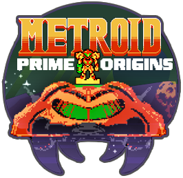

<div align="center">


  # Metroid Prime Origins
  ### Unofficial Nintendo Switch Homebrew Port

  *A wrapper/port of the acclaimed [fan game by Lv.4 Games]([url](https://www.reddit.com/r/Metroid/comments/1vhmcf8/metroid_prime_origins_new_fan_game_out_now/)) (GameMaker Studio 2 YYC)*
</div>

> [!IMPORTANT]
> This repository contains **only the Switch wrapper** - no game data and no GameMaker runner binary. You must supply those yourself.

## 💿 Installation

You need:

1. Your [Metroid Prime Origins v1.1.2 or later APK](https://www.reddit.com/r/Metroid/comments/1vhmcf8/metroid_prime_origins_new_fan_game_out_now/) (Latest Switch Supported version) **Hint:** Discord
2. This repo / [Switch Port Generator](https://bshurikan.github.io/mpo_nx/)
  
---

### Method S - Easy (web app, any OS)

1. Open the **Switch Port Generator** (button below).
2. Drop your **official Metroid Prime Origins Android APK v1.1.2**.
3. Click **Prepare SD** and download the generated zip file.
4. Extract → copy `mpo_nx/` → `sdmc:/switch/mpo_nx/`
5. Launch `mpo_nx.nro` with **full RAM** (hold **R**, or use a forwarder)

[](https://bshurikan.github.io/mpo_nx/)
<!--
---

<details>
<summary>Method A - Easy (Windows prep script) [Depricated]</summary>

> **Important:** from 1.1.2d onward use **[Switch Port Generator](https://bshurikan.github.io/mpo_nx/)**

> Same result as the web tool, using the release zip.

1. Extract **`mpo-switch-release.zip`**.
2. Double-click and run **`tools/Prepare SD Card.bat`**.
3. Select your **Metroid Prime Origins Android APK** when prompted.
4. Copy the generated **`sd_card/mpo_nx/`** folder to **`sdmc:/switch/mpo_nx/`** 

> If the script fails, use Method A (browser) or Method B.</details>

---

<details>
<summary>Method B - Moderate (Manual any OS) [Depricated]</summary>
   
> **Important:** Manual installs do **not** apply the QOL mods. Prefer Method A NEW or OLD so `libyoyo.so` gets Ship teleport and Teleport order. Without the patch, the game still runs; just no mods.

1. Extract **`mpo-switch-release.zip`**. You should have a **`mpo_nx/`** folder with:
   - `mpo_nx.nro`
   - `config.txt`
   - `gamecontrollerdb.txt`
   - `sdl2.txt`
2. Copy **Origins Android YYC APK** into **`mpo_nx/`** and rename to **`game.apk`**.
3. Open **`game.apk`** with any zip tool (7-Zip, WinRAR, macOS Archive Utility, etc.) and extract:
   - **`lib/arm64-v8a/libyoyo.so`** → **`mpo_nx/libyoyo.so`**
   - The entire **`assets/`** folder → **`mpo_nx/assets/`**
4. Copy **`sdl2.txt`** from the release folder into **`mpo_nx/assets/sdl2.txt`** as well (overwrite if the APK already has one). This helps Switch gamepad mapping on YYC.
5. Confirm **`config.txt`** has **`input_profile 1`** (required for YYC / Input 10; wrapper default).
6. Copy the finished **`mpo_nx/`** folder to **`sdmc:/switch/mpo_nx/`**.
</details>

---
-->
Final layout:

```
sdmc:/switch/mpo_nx/
├── mpo_nx.nro
├── config.txt
├── gamecontrollerdb.txt
├── sdl2.txt
├── game.apk                 ← your Origins Android YYC APK (renamed)
├── libyoyo.so               ← from APK lib/arm64-v8a/
└── assets/                  ← from APK assets/ (+ sdl2.txt overwrite)
    ├── game.droid
    ├── sdl2.txt
    └── ...
```

## 🎮 Controls

| Switch Input | Action |
|--------|--------|
| D-pad / Left stick | Move / menus |
| Face buttons | Origins defaults (A accept/jump, etc.) |
| **ZL / ZR** | Scan / Grapple |
| **Minus (−)** | Map |
| **Plus (+)** | Menu / pause |
| **L3 + R3** | **NX Options** menu |

<br>

<br>

## 🔧 Configuration

| Key | Default | Notes |
|-----|---------|-------|
| `show_fps` | `1` | On-screen FPS |
| `vsync` | `1` | Harmless |
| `docked_clocks` | `1` | Higher GPU in handheld when allowed |
| `aspect_ratio` | `1` | 0=Original 4:3 (letterboxed) 1=Stretched 16:9 (distorted) |
| `handheld_docked` | `1` | Force official docked 768 MHz while undocked |
| `menu_bg` / `menu_transparency` | Constellation / 0 | NX Options backdrop |
| `ship_teleport` | `1` | Landing Site ship as teleport destination |
| `teleport_order` | `1` | `0` discovery, `1` Organized (menu only) |
| `input_profile` | `1` | YYC / Input 10 |

> [!TIP]
> **In-game:** press **L3 + R3** to open **NX Options**. Toggle FPS / VSync / clocks / resolution (changes written to `config.txt`).

## 🌡 Performance

As of v1.1.0 this port uses YYC APK (I had the pleasure of working directly with Lv.4 to release the Android version), this allows for 100% full speed except in some rooms with many sprites. It is 100% playable, enjoy! 

> [!NOTE]
> As of v1.1.2d performance has been significantly improved and maintains a solid 50-60fps for silky smooth gameplay in areas that used to have slow down like Tallon Canyon, Phendrana Shorelines, Fungal Hall B and Metroid Nursery. 

## 👾 Credits

- Wrapper based on the Android GameMaker loader pattern (How Many Dudes / fgsfds, Andy Nguyen).
- Metroid Prime Origins by Lv.4 Games (fan project). Not affiliated.
- Compatible VM runner sourced from Castlevania ReVamped Android (bytecode 17).
